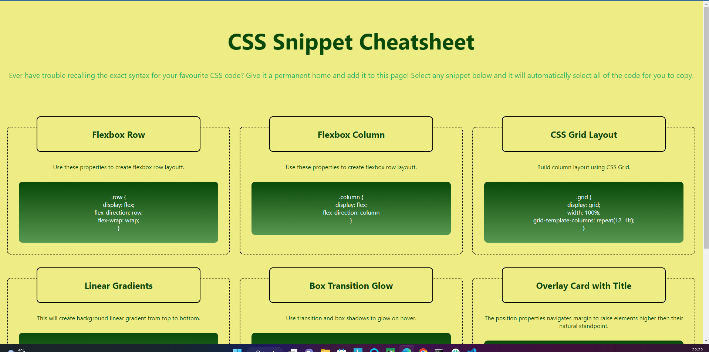

# CSS_mini_Cheatsheet
Small challenge in class, keeping track of interesting CSS features
## Description
Table like spreadsheet with tips for CSS. Created with grid while practising styling options in CSS.
## Usage
To see as website and one click copy feature on cards.
Suitable to use on phones and tablets.
## Screenshot

## Credits
Coded by myself(FranAli) instructions and design template provided by BootCamp.
